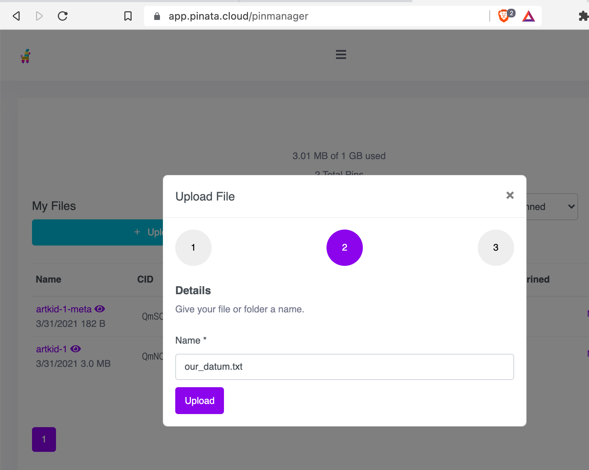

With all this [talk about NFTs](/blog/why-the-nft-is-such-a-big-deal/) and questions about what type of content can be uploaded and verified, I thought it's important we take a step back and look at what an NFT actually is at the ground level.

## Create your datum

In the world of NFTs, datum is the "thing" we attach to the smart contract. There's lots of tools and tech to do this, but basically what we are doing is taking a piece of content and deriving a unique identifier from the content itself. This produces a unique string known as a CID (content identifier).


[IPFS solves content addressing](https://docs.ipfs.io/concepts/content-addressing/) decentralized way — so it's a common choice for NTFs.

Unique content can be encoded, distributed in permanent fashion, and value set by participants taking part at the exchange levels.

One popular approach to persisting NFT content is to generate a CID for both the content and the description of the content. This creates an abstraction between the smart contract, the blockchain, the place we host, and the contents itself. It also gives better control by creating unique hashes from the content that are easier to detect if they change. Let's look at how you do that.

### Encode it

Let's create a simple message that we want to share with a friend. The contents of this file could be anything (a .jpeg, .mp3, .pdf, .docx, .cvs or combination of files - just to name a few), but to keep it simple, we'll just roll with a plain text file.

```bash
echo "the game" > our_datum.txt
```

Now put this `our_datum.txt` and upload it to IPFS. The purpose is to give us an immutable record encoded to a single location.



- <a href="https://ipfs.io/ipfs/QmdTy12YfQqnrkMuAL2g2rNQP6KRVb1gGKfVDXQSybqyGB">`https://ipfs.io/ipfs/QmdTy12YfQqnrkMuAL2g2rNQP6KRVb1gGKfVDXQSybqyGB`</a>

There are several tools and SDKs you can use to get a file onto IPFS, but by far the easiest way is through <https://app.pinata.cloud/>. Pinata works as a gateway to the IPFS network and lets you upload content (kinda like Dropbox). It's a helpful shortcut so you don't have to run an IPFS node yourself.

### Abstract it

With this universal record, we can put our immutable message in a JSON file to describe the contents. By now [there are standards the help you organize the JSON structure](https://eips.ethereum.org/EIPS/eip-721), but we won't get into those details. For now, what you should understand is the reason for this abstraction: it creates an unchangeable link from the blockchain to the data for our NFT token. This makes it more difficult for someone to play with the contents.

```
// NFT Metadata
{
  "name": "A message for you",
  "description": "This is a note for someone to read.",
  "contents": "https://ipfs.io/ipfs/bafybeiek7n4xnaunlw6fmkrpxtjqeqrp7u4tmtvvvhgw3yziz4mvdx6bwq"
}
```

Like we did earlier with the txt file, we take this new JSON blob and upload it to IPFS. This creates a primary link along with the description of the message.

```
tokenURI: "https://ipfs.io/ipfs/QmZ3JESoMLQeKcvRTsP44KQJ3jVF3F2KnQ3hA92eqdMWyR"
```

Normally, [best practices say you'd want to use the IPFS protocol](https://docs.ipfs.io/how-to/best-practices-for-nft-data/) instead of HTTPS, but I'm linking the free ipfs.io gateway to make it easier for standard browsers to handle this example.

### Put it on chain

This metadata `tokenURI` can now be assigned to a blockchain using smart contracts. How you implement that can get very technical. But as long as the smart contract implements all the policies of the [ERC-721 standard](https://eips.ethereum.org/EIPS/eip-721) or similar, it will be an NFT. These days, many contracts support for adding and updating URI addresses, that helps simplify common use cases.

At a minimum, your NFT should emit at least one ERC-721 compliant transfer. If you were to implement this on an EVM based programming language like Solidity, it looks something like:

```solidity
event Transfer(address indexed _from, address indexed _to, uint256 indexed _tokenId);
```


### Other examples

Some blockchain support the previous encoding and abstraction natively. For example, Cardano lets you encode and hash this data automatically with no additional script.

It is a bit of an oversimplification, but using the Cardano CLI you can build a file that keeps all the policy of the contract coupled with some protocol related metadata in the JSON format seen earlier. There's much more you need to do to set this up and sign the transaction, but the relevant parts would be in generating a EUXTO address using similar hashing concepts as with CIDs.

```bash
cardano-cli query policy-parameters --mainnet --out-file metadata.json
```

Cardano NFTs can use its native minting policy or choose to couple an approach with other chains like we saw earlier with IPFS. Cardano plans include the concept of [token converter](https://iohk.io/en/blog/posts/2021/12/07/the-agix-erc20-converter-testnet-is-now-live/) that will allow treasuries to easily convert token policies from one chain to another.

## How content addressing works

Uploading different data creates a different CID. But if you were to upload the same content to two IPFS nodes, it would produce the same CID. This helps ensure the data is unique. And also gives us a way to signal that the data has somehow changed.

Instead of a regular URL like [`https://matthewhendricks.net/our_datum.txt`](/our_datum.txt) that anyone could update and change the contents, we have a CID where if someone were to change the contents, the hashing algorithm would generate a whole new CID.

For example, change the contents of `our_datum.txt` by one character and the hash changes

- from [`QmdTy12YfQqnrkMuAL2g2rNQP6KRVb1gGKfVDXQSybqyGB`](https://ipfs.io/ipfs/QmdTy12YfQqnrkMuAL2g2rNQP6KRVb1gGKfVDXQSybqyGB)
- to [`QmdciwtvvoJubTrE8w1zNyFvjNCD5etsqTfsBWtrJr2fzZ`](https://ipfs.io/ipfs/QmdciwtvvoJubTrE8w1zNyFvjNCD5etsqTfsBWtrJr2fzZ)

This type of hashing makes it so no one can fool the smart contract the runs the policy attached to the datum.

You can use the CID Inspector or the CID Info panel in [IPLD Explorer](https://explore.ipld.io/) for an interactive breakdown of differently formatted CIDs.

As long as the data can be encoded in this manner, we can list it as an NFT. You might start with Jpegs and audio files, but this process can apply to many forms digital content that exchange participants can now set the value through the smart contract's policy of arbitration.


Hopefully, that is enough to help you understand the basics of an NFT. If you want to take more hands on approach, it would require digging into the Smart Contract code itself. A good start would be look at the [interactive OpenZeppelin Contracts generator](https://wizard.openzeppelin.com/) to bootstrap to EVM compatible smart contract that runs with current security best practice features already built into it.

You can test and deploy your contract using https://remix.ethereum.org/ on Ethereum networks or an alt-chain like [Harmony](https://docs.harmony.one/home/developers/deploying-on-harmony/using-remix/ethereum-remix) `testnet` and `mainnet`.

Other development tools that might find interesting are [Hardhat](https://hardhat.org/) for Solidity "Javascript" like experience or [Brownie](https://github.com/eth-brownie/brownie) for a Python-based environment and testing framework.

You can also explore more robust NFT metadata storage solutions like [https://nft.storage/#getting-started](NFT.Storage) (which is promoted by [IPFS official](https://blog.ipfs.io/how-to-store-and-maintain-nft-metadata/))
